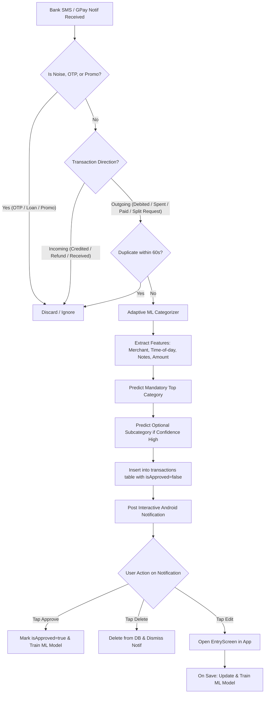

# Auto Expense Capture & Verification: Architecture & Implementation Plan

## Problem & Motivation
Currently, all transactions in Money Manager require manual entry. To make expense tracking automatic, intelligent, and seamless:
1. Detect transactions from **Bank SMS alerts** (covering Google Pay direct payments, user-initiated group splits, and Debit/Credit cards) and **Google Pay split requests** via **Notification Listener**.
2. **Strict Debit vs Credit Filtering**: Guarantee that only **outgoing expenses** are captured. Never confuse incoming money (salary, credits, refunds, friends paying you back, cashbacks) with an expense, and ignore non-transactional noise (OTPs, promotional loan offers, balance alerts).
3. **Unified Data Model**: Store detected transactions directly in the main `transactions` table with `isApproved = false` (instead of keeping them in a detached pending table).
4. **Optional Subcategories**: Allow transactions to be assigned directly to top-level categories without forcing a subcategory. Update `EntryScreen` and `StatsScreen` to handle top-level category assignments cleanly.
5. **Adaptive Machine Learning Categorization Engine**:
   - **No hard-coded rule branching**: Uses an on-device multi-feature statistical ML classifier that learns from **merchant patterns**, **text tokens (notes/group titles)**, **time-of-day buckets**, and **amount brackets**.
   - **Continuous Online Learning**: Every time you approve or edit a transaction, the ML model updates its weights. It automatically learns habits over time without manual rules.
   - **Strict Constraints**: Never creates new categories (uses only existing categories in your database). Top-level category is mandatory (fallback: "Other" / "Others"). Subcategories are optional and only assigned when the ML model has high confidence.
6. **Interactive Android Notifications**: Displays a system notification for every detected transaction with inline **[ Approve ]**, **[ Delete ]**, and **[ Edit ]** actions.
7. **Dedicated Unapproved Transactions Screen**: A dedicated page for reviewing, editing, splitting, or approving unconfirmed transactions.

---

## Technical Architecture

### 1. Ingestion Pipeline & Strict Direction Filtering


### 2. Strict Filter Specifications:
- **Debit / Outgoing (EXPENSE)**:
  - Regex patterns strictly mandate debit indicators:
    `(?i)(debited|debited\s+by|spent|paid|transferred\s+to|purchase\s+of|charged\s+to|sent\s+rs)`
  - For GPay notifications:
    `(?i)(.+?\s+requested\s+[₹Rs\.]*\s*[\d,]+(?:\.\d{2})?)` (Split request made to you).
- **Incoming / Credit (REJECTED - NOT ADDED AS EXPENSE)**:
  - Messages matching credit indicators are instantly dropped:
    `(?i)(credited|credited\s+to|received|deposited|refund\s+of|cashback\s+of|received\s+from|sent\s+you)`
  - If a friend transfers you ₹1,000 or a merchant refunds you, it is **never** added to expenses.
- **Noise & Promotional Rejection**:
  - OTP patterns: `(?i)(otp|one\s+time\s+password|secret\s+code|verification\s+code|do\s+not\s+share)`
  - Promotional offers: `(?i)(pre-approved|apply\s+now|congratulations|cashback\s+offer|loan\s+upto)`
  - Balance updates: `(?i)(available\s+balance|avail\s+bal|ledger\s+balance)` without an explicit debit.

---

## Database Schema & Migration
- **`transactions` table**: Add `isApproved: Boolean = true` (Room migration `1 -> 2` with `ALTER TABLE transactions ADD COLUMN isApproved INTEGER NOT NULL DEFAULT 1`).
  - Manual entries: `isApproved = true`.
  - Auto-detected entries: `isApproved = false`.
- **`category_ml_weights` table**:
  - `featureKey`: String (e.g. `merchant:swiggy`, `time:morning`, `token:coffee`, `time:night`)
  - `categoryId`: Long (either top-level or subcategory ID)
  - `count`: Int (frequency of this feature co-occurring with this category)
- **Optional Subcategories**: Existing `transactions.categoryId` foreign key points to `categories.id`. Since `categories` holds both top-level rows (`parentId IS NULL`) and child rows (`parentId IS NOT NULL`), referencing a top-level category directly is fully supported by SQLite foreign keys.

---

## Adaptive Machine Learning Categorization Engine

### 1. Feature Extraction Pipeline
When an outgoing transaction is parsed, the engine extracts an observable feature vector $\vec{x}$:
- **`merchant:<clean_name>`**: Normalized merchant/payee name (e.g., `merchant:swiggy`, `merchant:chaipoint`).
- **`note_token:<word>`**: Normalized word tokens from GPay notes, group titles, or bank SMS remarks.
- **`time:<bucket>`**: Time-of-day bucket:
  - `time:morning` (05:00 – 11:30)
  - `time:afternoon` (11:30 – 16:30)
  - `time:evening` (16:30 – 20:30)
  - `time:night` (20:30 – 01:00)
  - `time:late_night` (01:00 – 05:00)
- **`day:<type>`**: `day:weekday` vs `day:weekend`.
- **`amount:<bucket>`**: `amount:micro` (< ₹200), `amount:small` (₹200–₹1,000), `amount:medium` (₹1,000–₹5,000), `amount:large` (> ₹5,000).

### 2. Probabilistic Scoring (Bayesian Multi-Signal Classification)
For any category $C$:
$$P(C \mid \vec{x}) \propto P(C) \times \prod_{f \in \vec{x}} P(f \mid C)$$
Using Laplace smoothing to handle unseen features cleanly:
- **Phase A (Mandatory Top Category)**:
  - Evaluates $P(C \mid \vec{x})$ across all available top-level categories.
  - The top-level category with the highest score is chosen.
  - If the confidence score is below the uncertainty threshold, it safely falls back to **"Other" / "Others"**.
- **Phase B (Optional Subcategory)**:
  - Evaluates subcategories strictly under the chosen top-level category.
  - If a subcategory's conditional probability significantly exceeds the uniform distribution threshold, that subcategory is assigned.
  - If confidence is ambiguous or no subcategories exist under the top category, the transaction remains attached directly to the top-level category.

### 3. Continuous Online Learning (Self-Improving)
Every time a transaction is approved or edited by the user:
```kotlin
fun train(features: List<String>, categoryId: Long)
```
- Increments co-occurrence weights in `category_ml_weights`.
- A single one-off anomalous transaction will not permanently distort predictions because historical frequency votes balance it out.
- The model automatically adapts to the user's personal routine, schedule, and lifestyle over time.

---

## UI Changes: Optional Subcategory & Stats Screen

1. **Category Picker & Entry Screen (`CategoryPicker.kt`, `EntryScreen.kt`)**:
   - Allow selecting the top-level category directly as the final selection (no forced subcategory selection).
2. **Statistics Screen (`StatsViewModel.kt`, `StatsScreen.kt`)**:
   - Pie chart slice grouping aggregates by `topLevelOf[it.categoryId] ?: it.categoryId`.
   - In category drilldown: Transactions belonging directly to the top-level category (with no subcategory) are presented cleanly under `"General"` or the main category name itself.

---

## Interactive Android Notification & Review Inbox

1. **System Notification for Detected Transactions**:
   - Unique ID per transaction.
   - **[ Approve ]**: One-tap approval $\rightarrow$ marks `isApproved = true`, triggers ML `train()`, dismisses notification.
   - **[ Delete ]**: Discards the transaction from database.
   - **[ Edit ]**: Launches app into `EntryScreen(transactionId)`.
2. **Unapproved Transactions Screen (`UnapprovedTransactionsScreen`)**:
   - Dedicated route in `Destinations.kt`.
   - Alert banner on `HomeScreen` if unapproved transactions exist.
   - List with individual **Approve**, **Edit** (with split calculator), and **Delete** actions.
   - **"Approve All"** button for fast batch approval.

---

## Phased Implementation Plan

### Phase 1: Database Migration, Model & Subcategory Updates
- Add `isApproved: Boolean = true` to `TransactionEntity`, `Transaction`, `BackupSnapshot`.
- Add `category_ml_weights` table.
- Add `MIGRATION_1_2` in `MoneyManagerDatabase`.
- Update `CategoryPicker` and `EntryViewModel` so subcategories are optional.
- Update `StatsViewModel` so direct top-level category transactions display cleanly.

### Phase 2: Ingestion Pipeline & Interactive Notifications
- `TransactionNotificationManager`: builds rich notification with Approve/Delete/Edit actions.
- `TransactionNotificationReceiver`: handles `ACTION_APPROVE` (updates status and trains ML model) and `ACTION_DELETE`.
- `SmsTransactionReceiver`: parses incoming bank SMS with strict DEBIT and noise filters.
- `TransactionNotificationListenerService`: parses GPay split requests (ignoring incoming money receipts).
- `TransactionParser`: regex engine with comprehensive unit tests for debits, credits, and noise.

### Phase 3: Adaptive ML Categorization Engine
- `CategorizationEngine`:
  - Feature extractor (`merchant`, `time`, `day`, `tokens`, `amount`).
  - Bayesian Multi-Signal Classifier for top categories and optional subcategories.
  - Incremental `train()` module updating SQLite weight tables.
  - Zero new category creation; fallback to "Other" / "Others".

### Phase 4: UI: Unapproved Transactions Screen & Home Screen Banner
- Implement `UnapprovedTransactionsScreen`.
- Implement `UnapprovedTransactionsViewModel`.
- Add `Unapproved` destination to navigation.
- Add Unapproved banner on `HomeScreen`.

---

## Verification Plan
1. **Unit Tests:**
   - `TransactionParserTest`:
     - Test that DEBIT messages (spent, paid, debited) are correctly parsed as `EXPENSE`.
     - Test that CREDIT messages (salary, credited, refund, cashback, "sent you money") are strictly ignored / rejected.
     - Test that OTPs, balance queries, and loan offers are rejected as noise.
     - Test GPay split requests vs GPay incoming transfers.
   - `CategorizationEngineTest`: Multi-feature learning, subcategory confidence, fallback to "Other".
   - Room migration `1 -> 2` test.
2. **Device & UI Verification:**
   - Verify selecting a top-level category directly in `EntryScreen`.
   - Verify `StatsScreen` displays transactions with top-level categories properly.
   - Verify SMS capture, notification actions (Approve/Delete/Edit), and `UnapprovedTransactionsScreen`.

